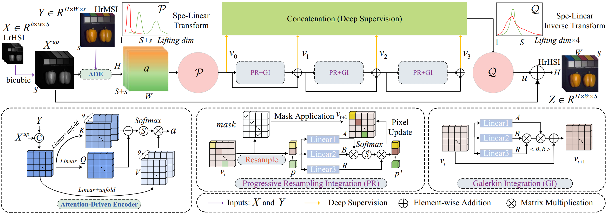

# Arbitrary‑Scale Spatial–Spectral Fusion using Kernel Integral and Progressive Resampling

> **Note:** This manuscript is currently under review.  
> Full training‐code details will be released immediately upon acceptance.

---
## 🍗 Model
- You can find detailed model architecture information here:


```bash
cd Assets/Model
```
---

## 📂 Dataset

- **Training data & Testing data:**  
  [CAVE Dataset](https://pan.baidu.com/share/init?surl=CXCJfzp2yfvJZ9Lg2i-mNA)  
  _Extraction code: `dju8`_

---

## ▶️ Quick Test

Clone or navigate into the `CAVE` directory and run the demo:

```bash
cd CAVE
python Test.py
```
